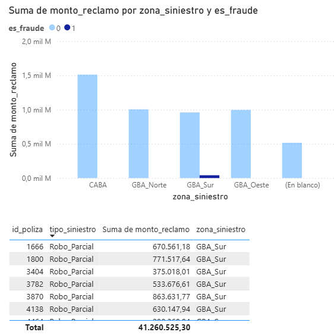

# Detección de Fraude en Seguros Automotores

# Contexto del Proyecto
Este proyecto analiza la siniestralidad de una cartera de seguros en Argentina. Como estudiante de Actuario en la UBA, me enfoqué en identificar patrones de fraude de suscripción (siniestros reportados < 15 días de vigencia) y su impacto financiero.

# Dashboard de Control

# Tecnologías Utilizadas
* Python (Pandas, Scikit-Learn): Limpieza de datos y entrenamiento de un modelo de Random Forest (Precisión: 100%).
* SQL (SQLite): Consultas para determinar el costo total del fraude por zona geográfica.
* Power BI: Visualización de KPIs actuariales y monitoreo de riesgos.

# Hallazgos Clave
* Fraude Detectado: 80 casos en GBA Sur.
* Impacto Económico: +$41.000.000 ARS identificados mediante lógica de datos.
